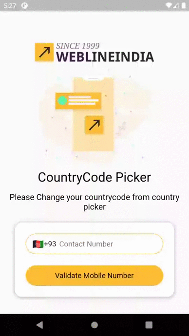

# Flutter - Country Picker Component

A reusable component in Flutter which provides country picker with custom dialogue which can be used in any application. 

## Table of contents
- [Flutter Support](#Flutter-support)
- [Demo](#demo)
- [Features](#features)
- [Getting started](#getting-started)
- [Usage](#usage)
- [Methods](#methods)
- [Want to Contribute?](#want-to-contribute)
- [Need Help / Support?](#need-help)
- [Collection of Components](#collection-of-Components)
- [Changelog](#changelog)
- [License](#license)
- [Keywords](#Keywords)

## Flutter Support

Version - Flutter 1.17(stable)

We have tested our program in above version, however you can use it in other versions as well.

## Demo

------

## Features

* Provides Country Picker with country flag, country name and dial code. 
* Customizable header as per requirements.

## Getting started

* Download this sample project and import CountryPicker Widget file in your Flutter App. 
* Update Header, Title based on your requirements. 

## Usage

Setup process is described below to integrate in project.

## Configure Country Picker in your widget by following below method steps

### Methods

Step 1. Create your Statefull or Stateless Widget

Step 2. Add Country Picker Widget
       
    // Put CountryPicker Widget
    CountryPicker(
        callBackFunction: _callBackFunction
    );
       
    // Create callback function 
    void _callBackFunction(String name, String dialCode, String flag) {
        // place your code
    }
       

Step 3. Pass header text if you want to change otherwise skip it             
       
    headerText: 'Select Country',

Step 4. Pass header background color if you want to change otherwise skip it  

    headerBackgroundColor: Colors.black 

Step 5. Pass header text color if you want to change otherwise skip it 

    headerTextColor: Colors.white

------

## Want to Contribute?

- Created something awesome, made this code better, added some functionality, or whatever (this is the hardest part).
- [Fork it](http://help.github.com/forking/).
- Create new branch to contribute your changes.
- Commit all your changes to your branch.
- Submit a [pull request](http://help.github.com/pull-requests/).

------

## Need Help? 

If you need any help then please contact our [Flutter developers](https://www.weblineindia.com/flutter-cross-platform-mobile-app-development.html).

 ------
 
## Collection of Components

We have built many other components and free resources for software development in various programming languages. Kindly click here to view our [Free Resources for Software Development.](https://www.weblineindia.com/software-development-resources.html)
 
------

## Changelog

Detailed changes for each release are documented in [CHANGELOG](./CHANGELOG).

## License

 [MIT](LICENSE)

 [mit]: https://github.com/weblineindia/Flutter-Country-Picker/blob/master/LICENSE

## Keywords

Flutter Country Picker, Country Picker, Picker, Country Dialogue, Custom Dialogue , Weblineindia
